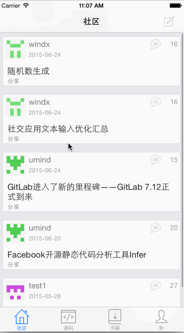

Swiftmi-APP (Dev Share)
=========

**Dev Share**为[www.swiftmi.com](http://www.swiftmi.com) 社区app(已上线),纯Swift实现,现将开源~.

Swift开发QQ交流群：305170435

目前社区功能不全,欢迎贡献代码，相互学习.

 

 
##Screenshots

##build

程序中 [Alamofire](https://github.com/Alamofire/Alamofire)、[Kingfisher](https://github.com/onevcat/Kingfisher)、[SwiftyJSON](https://github.com/SwiftyJSON/SwiftyJSON) 为submodule引用方式

有些不熟悉git朋友不清楚怎么获取,请按如下步奏即可

- git clone https://github.com/feiin/swiftmi-app  swiftmi
- cd swiftmi && git submodule update --init --recursive
- 打开xcode编译运行即可

 
##更新

- 20150711  **增加handoff**：在内容(主题、源代码)详情界面阅读时增加handoff,支持mac 默认浏览器打开阅读详情
- 2015092  升级Swift2.0,Xcode7.0编译下通过

##环境

- Xcode 7.0 编译通过
- Swift 2.0

网友@sandyway实现的对应OC版本 https://github.com/sandyway/ocswiftmi

swift迷社区 http://www.swiftmi.com

